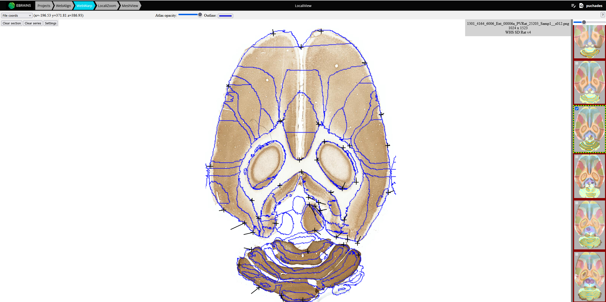

**What is WebWarp?**
=======================
WebWarp is one of several tools developed by the NeSys laboratory at University of Oslo with the aim of facilitating brain atlas-based analysis and
integration of experimental data and knowledge about the  rodent brain. 

WebWarp is an online tool for non-linear spatial registration of histological section images from rodent brains to reference 3D atlases.
Different experimental datasets registered to the same reference atlas allows you to spatially integrate, analyse and navigate these datasets within a standardised coordinate system.
The linear registration obtained with WebAlign can be refined with the WebWarp tool (https://webwarp.readthedocs.io/en/latest/).

These online registration tools can be accessed through our integrated workflows with an EBRAINs account:  the QUINT online workflow, accessible here: https://quint-online.apps.ebrains.eu/, or the LocaliView workflow: https://localiview.apps.ebrains.eu/.

**Data from**: Laja et al. (2025). Distribution of parvalbumin-positive interneurons in the normal adult rat brain (v2) [Data set]. EBRAINS. https://doi.org/10.25493/MB6S-K0S

**Which atlases are supported?**
-----------------------------
1. Allen Mouse Brain Atlas Common Coordinate Framework version 3 (2015 and 2017) (CCFv3) (Wang et al. 2020. Cell, https://doi.org/10.1016/j.cell.2020.04.007. Epub 2020 May 7; RRID:JCR_020999 and RRID:JRC_021000) 
2. Waxholm Atlas of the Sprague Dawley rat, version 3 and 4 (WHS rat brain atlas) (Osen et al. 2019. NeuroImage, https:doi.org/10.1016/j.neuroimage.2019.05.016; Kleven et al. Nat Methods, 2020. https://doi.org/10.1038/s41592-023-02034-3; RRID:SCR_017124)

**What is the output of WebWarp?**
---------------------------------

-A registration file (JSON format) containing the coordinates of your registered section images in atlas space. This file is then used in the workflows automatically.
