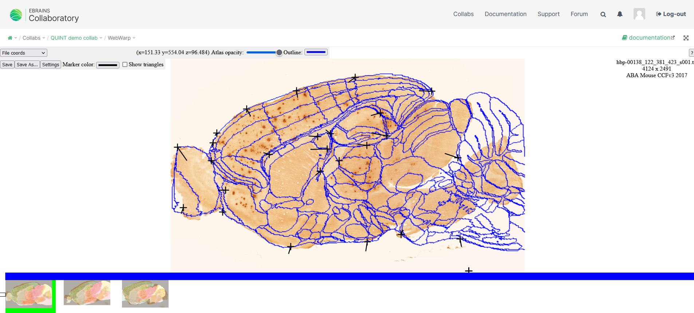

**Introduction**
------------------- 
Different experimental datasets registered to the same reference atlas allows you to spatially integrate, analyse and navigate these datasets within a standardised coordinate system.
WebWarp is an online tool for nonlinear refinement of spatial registration of histological section images from rodent brains to reference 3D atlases. Webwarp is compatible with registration performed with the WebAlign tool.

These registration tools can be used as individual webapps in the EBRAINS collaboratory or integrated in the QUINT workflow, accessible here: `Online Workbench <https://neural-systems-at-uio.github.io/>`_, register for an EBRAINS account and login.

Find manual for the online QUINT workflow here: https://quint-webtools.readthedocs.io/en/latest/

This user manual will guide through the steps for working in the collaboratory.

Dataset DOI: 10.25493/G6CQ-D4D
