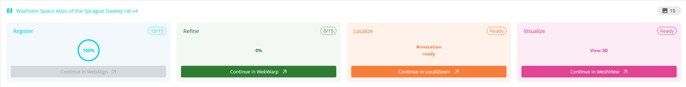

**WebWarp**
============

WebWarp is used to make nonlinear refinements to the atlas registration achieved using WebAlign. Adjustments are performed in-plane and are applied manually by dropping markers on the atlas overlay and dragging them to their correct position on the underlying section using anatomical landmarks. This step is optional.  

.. image:: images/WebWarp_Parv.png

**Data from**: Laja et al. (2025). Distribution of parvalbumin-positive interneurons in the normal adult rat brain (v2) [Data set]. EBRAINS. https://doi.org/10.25493/MB6S-K0S

**How to access WebWarp?**
----------------------------

In your project, Open WebWarp by selecting "Continue to WebWarp" or from the top tools bar. 

**How to make adjustments?**
---------------------------

1. The sections are visible in the Main Window with atlas overlays achieved using WebAlign. Switch between different versions of the atlas overlay using the transparency slider: “Atlas opacity”. The color of the atlas outline can be modified by clicking on the coloured rectangle.
2. To make an adjustment to the atlas overlay, place a marker on the part of the atlas that you wish to adjust by pressing the space bar. Adjustments are made by dragging the marker using the mouse cursor.
3. To remove a marker, position the mouse cursor over the marker and press Delete or Backspace. 
4. Markers can also be used as anchor points, fixing in place parts of the registration that are correct. 
5. To view the transformations applied, go to “Settings” and “show triangles”. 

.. tip::
 A good strategy is to place markers around the contour of the section first (use them as anchors), and then proceed by refining the inner parts.
 
 Try to keep the number of markers to a minimum. 

6. Once you are satisfied with the result, tick the checkbox on the section. This will save your markers. The contour of the section in the filmstrip will change color from burgundy to green.
You can now proceedto the next section image. Repeat the operation to all images.

7. You are now ready for the next step of the workflow.
 
